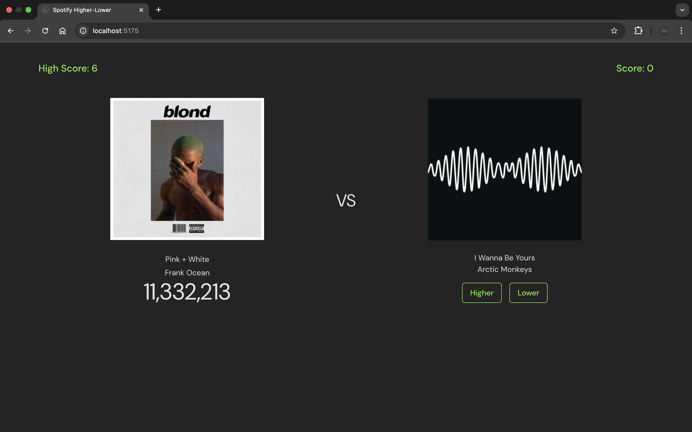

# Spotify Higher or Lower 🎵

A browser game built with React where users guess which song has more streams on Spotify.

---



---

## 🚀 Setup

1. Clone and install:
```bash
git clone https://github.com/yourusername/spotify-higher-lower.git
cd spotify-higher-lower
yarn install
```

2. Run locally:
```bash
yarn dev
```

3. Open:
```
http://localhost:5173
```

---

## ⚡️ Scripts

```bash
yarn dev    # Run development server
yarn build  # Build for production
yarn test   # Run tests
```

---
